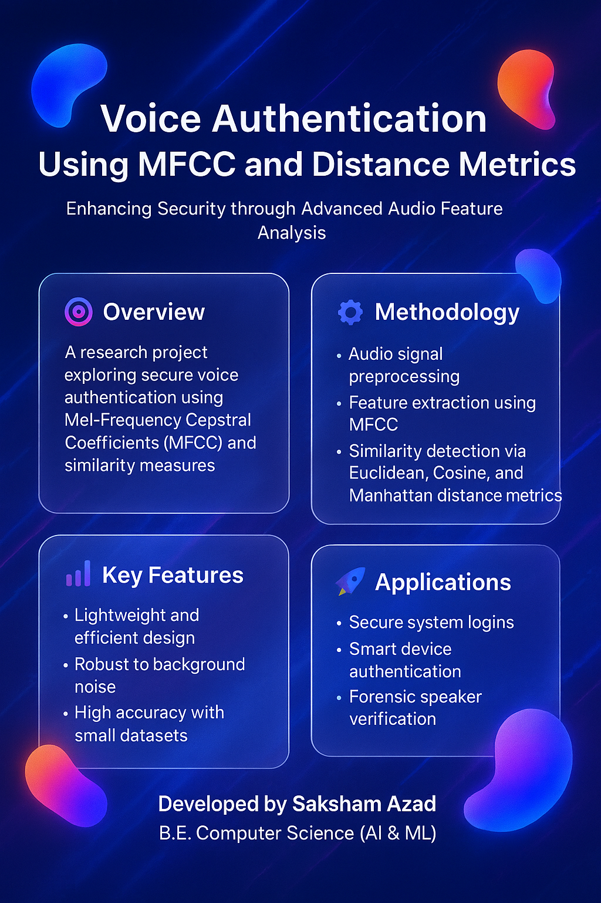
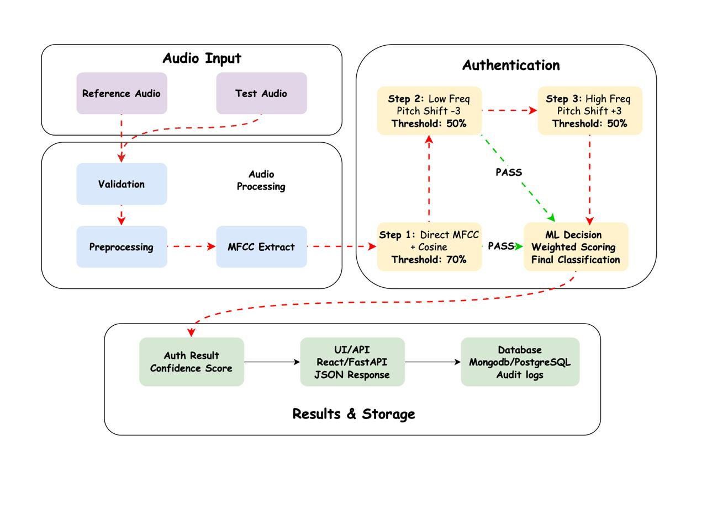

# Voice Authentication Research System

<p align="center">
  
</p>

A comprehensive three-step voice authentication system using MFCC feature extraction and multiple audio transformations to improve robustness against voice spoofing attacks.

## 🎯 Overview

This research system implements a novel three-step voice authentication algorithm that combines:

1. **Direct MFCC Comparison** - Standard feature matching
2. **Low Frequency Analysis** - Pitch-shifted feature comparison (-3 semitones)  
3. **Pitch Shift Analysis** - Pitch-shifted feature comparison (+3 semitones)

The multi-step approach provides enhanced security against various voice spoofing and synthesis attacks.

## 🏗️ System Architecture

```
voice-authentication-system/
├── audio_processor.py      # Audio processing and feature extraction
├── voice_authenticator.py  # Core authentication logic
├── streamlit_app.py        # Web interface
├── main.py                 # Command-line demo
├── config.py              # Configuration management
├── requirements.txt        # Dependencies
└── README.md              # Documentation
```

## 🚀 Quick Start

### Installation

1. Clone or download the repository
2. Install dependencies:
```bash
pip install -r requirements.txt
```

### Web Interface

Launch the Streamlit web application:
```bash
streamlit run streamlit_app.py
```

Navigate to `http://localhost:8501` in your browser.

### Command Line Usage

For research and batch processing:
```bash
python main.py --reference reference_audio.wav --input test_audio.wav
```

Full command line options:
```bash
python main.py \
    --reference ref.wav \
    --input test.wav \
    --direct-threshold 0.7 \
    --low-freq-threshold 0.5 \
    --pitch-threshold 0.5 \
    --n-mfcc 13 \
    --output results.json \
    --verbose
```

## 📊 Algorithm Details

### Feature Extraction
- **MFCC (Mel-Frequency Cepstral Coefficients)**: 13 coefficients by default
- **Frame size**: 2048 samples
- **Hop length**: 512 samples
- **Sample rate**: 22.05 kHz (standard)

<p align="center">
  
</p>

### Authentication Steps

#### Step 1: Direct Comparison
```python
# Extract MFCC features from original signals
ref_features = extract_mfcc(reference_audio, sr)
test_features = extract_mfcc(test_audio, sr)

# Compute cosine similarity
similarity = 1 - cosine_distance(ref_features, test_features)
```

#### Step 2: Low Frequency Analysis
```python
# Apply pitch shift (-3 semitones)
ref_low = pitch_shift(reference_audio, n_steps=-3)
test_low = pitch_shift(test_audio, n_steps=-3)

# Extract and compare features
similarity_low = compute_similarity(ref_low, test_low)
```

#### Step 3: Pitch Shift Analysis
```python
# Apply pitch shift (+3 semitones)
ref_high = pitch_shift(reference_audio, n_steps=+3)
test_high = pitch_shift(test_audio, n_steps=+3)

# Extract and compare features
similarity_pitch = compute_similarity(ref_high, test_high)
```

### Decision Logic
Authentication succeeds if **ALL** three steps pass their respective thresholds:
- Step 1: ≥ 0.7 (70% similarity)
- Step 2: ≥ 0.5 (50% similarity)  
- Step 3: ≥ 0.5 (50% similarity)

## 🔧 Configuration

### Default Parameters
```python
# Similarity thresholds
DIRECT_THRESHOLD = 0.7
LOW_FREQ_THRESHOLD = 0.5
PITCH_SHIFT_THRESHOLD = 0.5

# MFCC parameters
N_MFCC = 13
N_FFT = 2048
HOP_LENGTH = 512
```

### Custom Configuration
Create a `config.json` file:
```json
{
  "similarity_thresholds": {
    "direct": 0.75,
    "low_freq": 0.6,
    "pitch_shift": 0.55
  },
  "mfcc_params": {
    "n_mfcc": 15,
    "n_fft": 4096,
    "hop_length": 256
  }
}
```

Load with:
```bash
export VOICE_AUTH_CONFIG=config.json
python main.py --reference ref.wav --input test.wav
```

## 📈 Performance Metrics

The system provides comprehensive performance analysis:

- **Individual step similarities** (0-100%)
- **Overall confidence score** (average of all steps)
- **Step-by-step pass/fail status**
- **Processing time** (seconds)
- **Threshold comparison** (visual indicators)

## 🎨 Web Interface Features

- **Drag & drop audio upload** (WAV, MP3, M4A, FLAC)
- **Real-time audio playback** 
- **Interactive threshold adjustment**
- **Radar chart visualization** of similarity scores
- **Confidence gauge** with color-coded results
- **Detailed step analysis** with pass/fail indicators
- **JSON export** of results
- **Performance metrics** dashboard

## 🔬 Research Applications

### Robustness Testing
The system is designed for research into:
- Voice spoofing detection
- Synthetic speech identification  
- Cross-channel authentication
- Noise robustness analysis
- Real-time performance evaluation

### Evaluation Metrics
- **False Acceptance Rate (FAR)**
- **False Rejection Rate (FRR)**
- **Equal Error Rate (EER)**
- **Detection accuracy** across attack types
- **Processing efficiency** metrics

## 📝 API Reference

### VoiceAuthenticator Class

```python
from voice_authenticator import VoiceAuthenticator

# Initialize
authenticator = VoiceAuthenticator(
    similarity_threshold_direct=0.7,
    similarity_threshold_low=0.5,
    similarity_threshold_pitch=0.5,
    n_mfcc=13
)

# Authenticate
results = authenticator.authenticate(ref_bytes, test_bytes)
```

### AudioProcessor Class

```python
from audio_processor import AudioProcessor

# Initialize  
processor = AudioProcessor(n_mfcc=13)

# Extract features
features = processor.extract_mfcc_features(audio_signal, sample_rate)

# Apply transformations
shifted_audio = processor.apply_frequency_shift(audio_signal, sr, n_steps=-3)
```

## 🛠️ Dependencies

### Core Requirements
- `librosa==0.10.1` - Audio analysis
- `numpy==1.24.3` - Numerical computations
- `scipy==1.11.1` - Scientific computing
- `streamlit==1.28.1` - Web interface

### Visualization
- `plotly==5.17.0` - Interactive charts
- `pandas==2.0.3` - Data manipulation

### Audio Support
- `soundfile==0.12.1` - Audio file I/O
- `audioread==3.0.0` - Format support

## 🚨 Known Limitations

1. **File size**: Large audio files (>50MB) may cause memory issues
2. **Real-time**: Not optimized for real-time streaming authentication
3. **Formats**: Limited to common audio formats (WAV, MP3, M4A, FLAC)
4. **Languages**: Tested primarily on English speech samples

## 🤝 Contributing

This is research code. For improvements:

1. Fork the repository
2. Create feature branch (`git checkout -b feature/improvement`)
3. Add tests for new functionality
4. Submit pull request with detailed description

## 📄 License

This research code is provided for academic and research purposes. 

## 📧 Contact

For research inquiries and collaboration opportunities, please contact the research team.

---

**Built with ❤️ for voice authentication research | August 2025**
